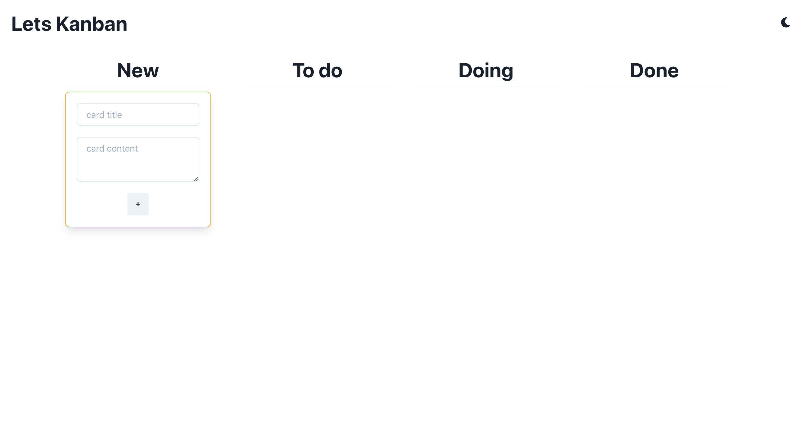
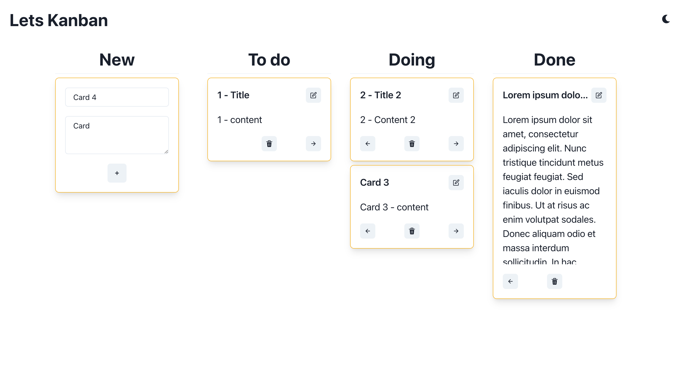
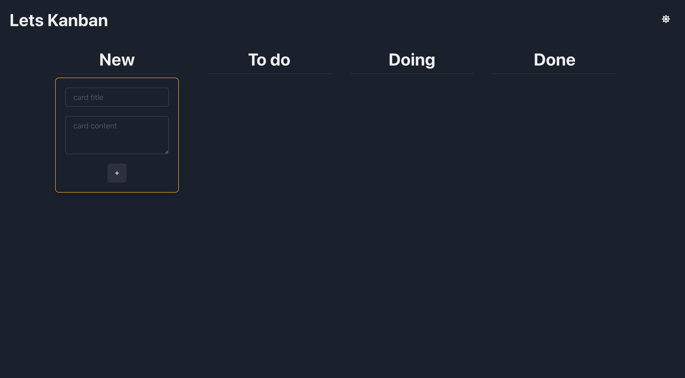
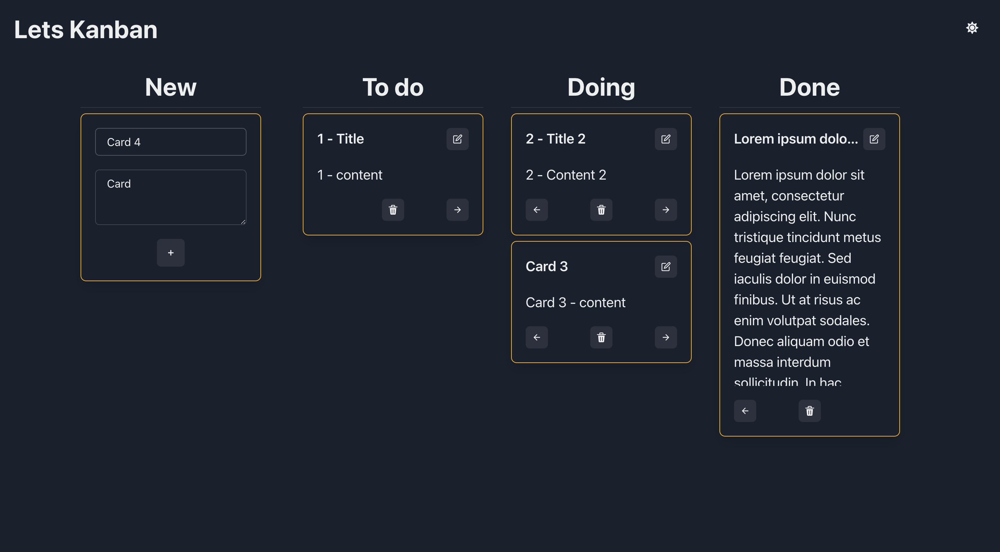

<h1 align="center">Let's Kanban App </h1>

  
  
  

  
  
  
  

## Kanban application

> *FullStack kanban board application made with React and Nestjs, both with typescript.*

The frontend project is inside the folder FRONT and has a [README.md](./FRONT/README.md) file with instructions about the project

The backend project is inside the folder BACK and also has a [README.md](./BACK/README.md)

## Demo

Check the frontend app at:

[https://letskanban.vercel.app/](https://letskanban.vercel.app/)

And the swagger ui for the api at:

[https://kanban-nestjs.herokuapp.com/api/](https://kanban-nestjs.herokuapp.com/api/)

if you like using postman you can checkout a public collection that i made for the API

### Fernando Belotto

- Website: https://fernandobelotto.dev
- Github: [@fernandobelotto](https://github.com/fernandobelotto)
- LinkedIn: [@fernandobelotto](https://linkedin.com/in/fernandobelotto)
